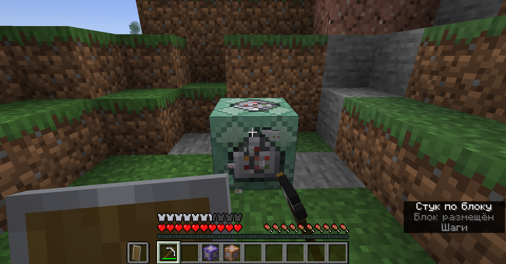
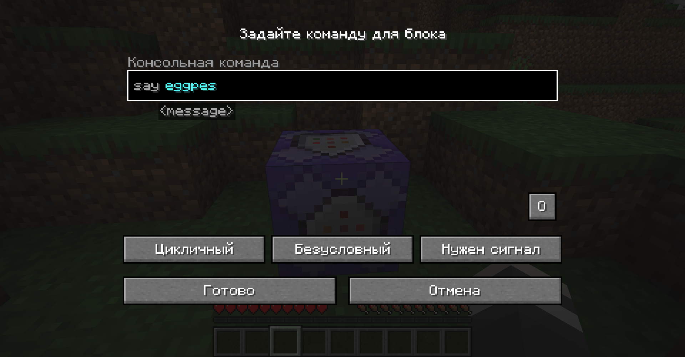
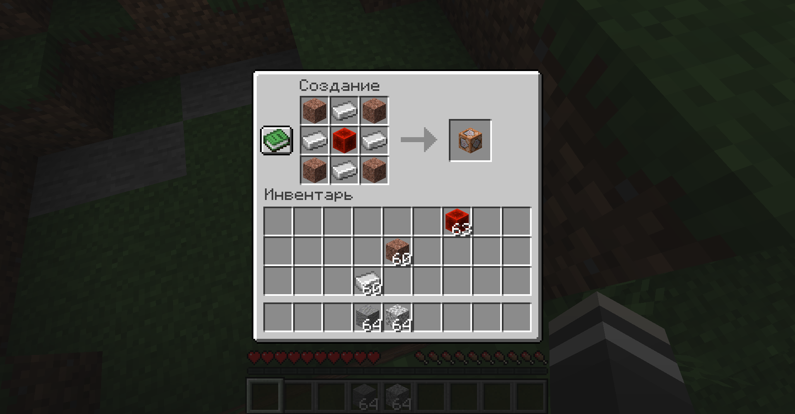
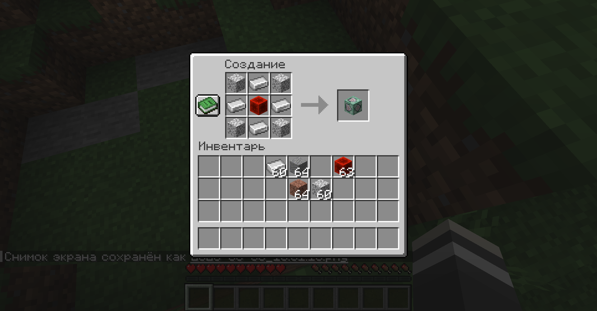
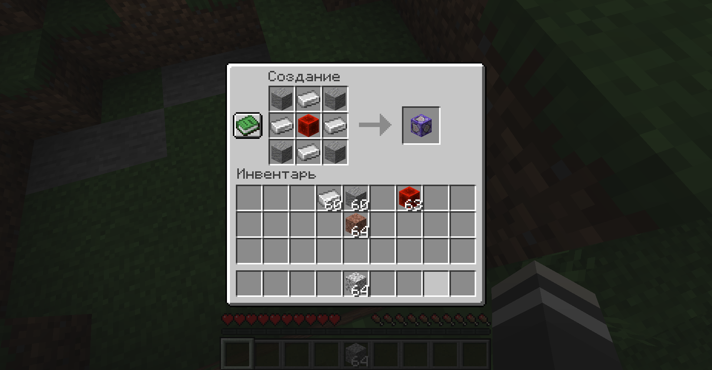
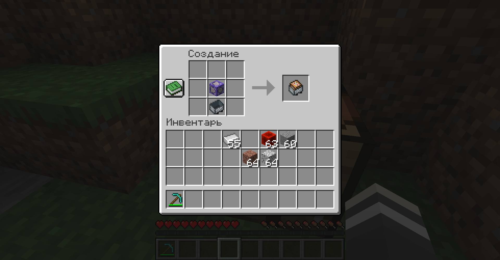

# Survival Command Blocks

*Command Blocks now made avalible and usable in a survival world near you!*

This mod (for Minecraft 1.19.3) makes command blocks craftable, placeable, editable, and destroyable by players in survival mode, regardless of whether they are an operator. 

They can be crafted with 4 iron ingots, a redstone block, and 4 blocks of either andesite, granite, or diorite for their respective command block (can also used polished variants, and of course you can switch the type of a command block in it's GUI.) View the screenshots for more information.

Whilst non-opped players can edit the command blocks, and can enter any command avalible on the server, they will only recieve auto-complete suggestions for commands they normally have access to. I haven't been able to figure out how to fix this yet, прости((

It is mainly intended to allow a survival playthrough with access to command blocks similiar to [Toy Box](https://www.youtube.com/playlist?list=PLGyo0_Pda1ECwOAM2QwCLxU-L2uW_JtpJ "SimplySarc's Toy Box series")/[Survival Commanders](https://www.youtube.com/playlist?list=PLaURolsKD_VEQ_W22mpaXYRZLWHC5bJpV "Zedaph's Survival Commanders series with SimplySarc"), a series by SimplySarc and Zedaph, and [Survival Commander](https://www.youtube.com/playlist?list=PLaURolsKD_VGoVCadwVdGqAdlWnTwoBdr "Zedaph's Survival Commander series") by Zedaph. The idea is that you can use them to create mechanisms, special effects, etc., but without cheating anything in that you did not obtain yourself (i.e. no using /give or using /fill unless you've done something to pay for it, like permanetly setting aside the equivalent blocks being filled inside a chest.) Of course, play how you want ;).

Note: if used on a dedicated server, the users will still need to install the mod as well.

## Installation

You will need to use the [Fabric Modloader](https://fabricmc.net/use/installer "Fabric Modloader Installer page") to use this mod.

You will also need to install the following dependency(ies):
- [Fabric API](https://www.curseforge.com/minecraft/mc-mods/fabric-api "Fabric API mod CurseForge page")

After that, grab a version from [RELEASES](https://github.com/ona-li-toki-e-jan-Epiphany-tawa-mi/Survival-Command-Blocks/releases "SurvivalCommandBlock's GitHub Releases page") and simply place it inside your mods folder.

## How to build

Java 17 or higher is required.

Run the following command(s) inside the project directory:

```console
./gradlew build
```

If on Windows instead of a POSIX system, run this instead:

```console
gradlew.bat build
```

The complied jar file should appear in build/libs/.

## Screenshots








## Links

- [PlanetMinecraft page](https://www.planetminecraft.com/mod/survival-command-blocks-fabric "Survival Command Blocks' Planet Minecraft page.")
- [CurseForge page](https://www.curseforge.com/minecraft/mc-mods/survival-usable-command-blocks "Survival Command Blocks' CurseForge page")